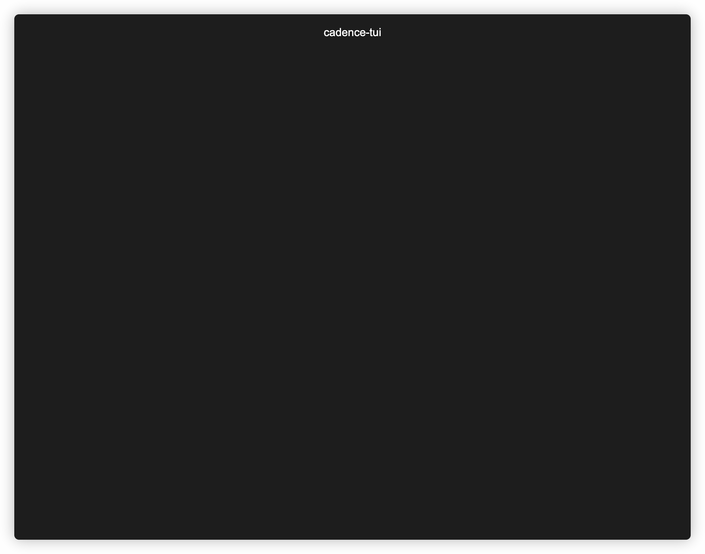

# Cadence TUI

A simple tool for exploring Cadence Workflows

### Usage
```bash
Usage:
  cadence-tui [OPTIONS]

Application Options:
  -a, --address= Cadence server address (default: localhost:7833)

Help Options:
  -h, --help     Show this help message
```

### Demo 
